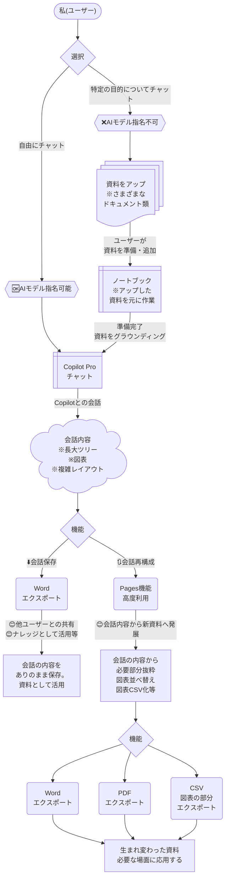

# Microsoft チャット画面による作業について

## なぜMicrosoft 365 Copilot Proチャットによる作業完結が必要か?

> いかなるAI-IDEやAI-CLIも使えない、チャットのみ可能な環境のため

## Microsoft Copilot Pro チャット画面の備える機能と作業の流れ

```mermaid
flowchart TD
   %%始端・終端
   ROOT-START(["私(ユーザー)"]);
   
   %%オブジェクト
   ROOT-O-00500@{shape: hex, label: "🆗AIモデル指名可能"};
   ROOT-O-00505@{shape: hex, label: "❌AIモデル指名不可"};
   ROOT-O-01000@{shape: win-pane, label: "Copilot Pro<br/>チャット"};
   ROOT-O-01100@{shape: rounded, label: "Word<br/>エクスポート"};
   ROOT-O-01200@{shape: rounded, label: "Pages機能<br/>高度利用"};
   ROOT-O-01300@{shape: rounded, label: "Word<br/>エクスポート"};
   ROOT-O-01400@{shape: rounded, label: "PDF<br/>エクスポート"};
   ROOT-O-01500@{shape: rounded, label: "CSV<br/>図表の部分<br/>エクスポート"};
   ROOT-O-02100@{shape: win-pane, label: "ノートブック<br/>※アップした<br/>資料を元に作業"};
   ROOT-O-02000@{shape: docs, label: "資料をアップ<br/>※さまざまな<br/>ドキュメント類"}

   %% アクション
   ROOT-A-01000@{shape: cloud, label: "会話内容<br/>※長大ツリー<br/>※図表<br/>※複雑レイアウト"};
   ROOT-A-01100["会話の内容を<br/>ありのまま保存。<br/>資料として活用"];
   ROOT-A-01200["会話の内容から<br/>必要部分抜粋<br/>図表並べ替え<br/>図表CSV化等"];
   ROOT-A-01300["生まれ変わった資料<br/>必要な場面に応用する"];

   %% ブランチ
   ROOT-B-00500{"選択"};
   ROOT-B-01000{"機能"};
   ROOT-B-01100{"機能"};

   %%フロー

   ROOT-START -->
   ROOT-B-00500;

   ROOT-B-00500 --> |自由にチャット| ROOT-O-00500 --> ROOT-O-01000;
   ROOT-B-00500 --> |特定の目的についてチャット| ROOT-O-00505 -->  ROOT-O-02000;

   ROOT-O-02000 -->
   |ユーザーが<br/>資料を準備・追加| ROOT-O-02100 -->
   |準備完了<br/>資料をグラウンディング| ROOT-O-01000;

   ROOT-O-01000 -->
   |Copilotとの会話| ROOT-A-01000 -->
   ROOT-B-01000;

   ROOT-B-01000 --> |⬇️会話保存|ROOT-O-01100;
   ROOT-B-01000 --> |🔃会話再構成|ROOT-O-01200;

   ROOT-O-01100 -->
   |😊他ユーザーとの共有<br/>😊ナレッジとして活用等| ROOT-A-01100;

   ROOT-O-01200 -->
   |😊会話内容から新資料へ発展| ROOT-A-01200;

   ROOT-A-01200 -->
   ROOT-B-01100;

   ROOT-B-01100 -->ROOT-O-01300 --> ROOT-A-01300;
   ROOT-B-01100 -->ROOT-O-01400 --> ROOT-A-01300;
   ROOT-B-01100 -->ROOT-O-01500 --> ROOT-A-01300;
   


```