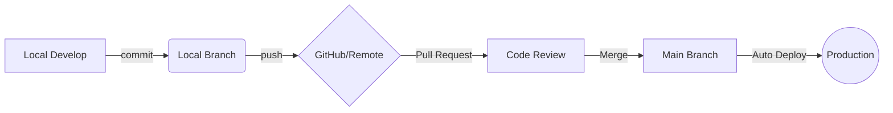

<h1 id="学習-モダンwebアプリ開発のための基礎ツールについて-tools-学習ガイドブック" style="background: linear-gradient(to right, #39C5BB, #FFC778);color: white;
    font-family: 'Hiragino Sans', 'Noto Sans JP', sans-serif;font-size: 1.5em;
    font-weight: 700;text-align: center;padding: 0.55em 1.5em;border-radius: 10px;
    letter-spacing: 0.08em;margin: 0; text-shadow: 0 0 8px #39C5BB, 0 0 20px #39C5BBaa, 0 0 40px #39C5BB55;">
    (BOOK)【学習】モダンWebアプリ開発のための基礎ツールについて【Tools】学習ガイドブック
</h1>

📚 本ガイドブックは、モダンWeb開発において ***Git, npm, TypeScript, Vite, 各種フレームワーク*** がなぜ「必須」とされるのか、その技術的背景と必然性を、従来の開発手法との比較を通じて解説します。単なるツールの使い方ではなく、エコシステムの進化という文脈から、現代の開発環境の正体を解き明かしましょう!!

---

# 目次
1. [Web開発エコシステムの変遷と「必然性」](#1-web開発エコシステムの変遷と必然性)
1. [Git：単なるバックアップから「協働とデプロイの基盤」へ](#2-git単なるバックアップから協働とデプロイの基盤へ)
1. [npm/Node.js：スクリプト配布から「依存関係管理の自動化」へ](#3-npmnodejsスクリプト配布から依存関係管理の自動化へ)
1. [TypeScript：JavaScriptに「型の堅牢性」を加えた必然](#4-typescriptjavascriptに型の堅牢性を加えた必然)
1. [Vite/ビルドツール：なぜJSに「ビルド」が必要なのか？](#5-viteビルドツールなぜjsにビルドが必要なのか)
1. [フレームワーク（React/Next.js）：命令型から「宣言型」へのパラダイムシフト](#6-フレームワークreactnextjs命令型から宣言型へのパラダイムシフト)
1. [よくある質問とトラブルシューティング](#7-よくある質問とトラブルシューティング)
1. [まとめ](#まとめ)

---

# 1. Web開発エコシステムの変遷と「必然性」

### 概要・説明

現代のWeb開発は、HTML/CSS/JSを書いてFTPでアップロードするだけの単純な作業ではなくなりました。ユーザーの要求（リッチなUI、高速なレスポンス、セキュリティ）が高度化した結果、それらを人力で管理することは不可能になり、***自動化と標準化*** のためのツール群が「必然的」に誕生しました。

技術の進化は、まるで命の芽吹きのように、必要とされる場所で次々と生まれてきたんです。

### ツール進化の比較表

<table style="width: 100%; border-collapse: collapse; font-family: sans-serif; min-width: 600px;"><thead><tr style="background: linear-gradient(to right, #39C5BB, #FFC778); color: white;"><th style="padding: 15px; text-align: left; font-weight: 600; border-bottom: 2px solid rgba(255,255,255,0.2);">ツールカテゴリ</th><th style="padding: 15px; text-align: left; font-weight: 600; border-bottom: 2px solid rgba(255,255,255,0.2);">従来のやり方（Before）</th><th style="padding: 15px; text-align: left; font-weight: 600; border-bottom: 2px solid rgba(255,255,255,0.2);">モダンなやり方（After）</th><th style="padding: 15px; text-align: left; font-weight: 600; border-bottom: 2px solid rgba(255,255,255,0.2);">解決された課題</th></tr></thead><tbody><tr style="background-color: #f9f9f9; transition: background-color 0.3s;" onmouseover="this.style.backgroundColor='#f0fcfb'" onmouseout="this.style.backgroundColor='#f9f9f9'"><td style="padding: 12px 15px; border-bottom: 1px solid #eee; color: #444; line-height: 1.6;">**バージョン管理**</td><td style="padding: 12px 15px; border-bottom: 1px solid #eee; color: #444; line-height: 1.6;">手動コピー・日付フォルダ</td><td style="padding: 12px 15px; border-bottom: 1px solid #eee; color: #444; line-height: 1.6;">Git / GitHub</td><td style="padding: 12px 15px; border-bottom: 1px solid #eee; color: #444; line-height: 1.6;">修正の競合、変更履歴の追跡不能</td></tr><tr style="background-color: #ffffff; transition: background-color 0.3s;" onmouseover="this.style.backgroundColor='#f0fcfb'" onmouseout="this.style.backgroundColor='#ffffff'"><td style="padding: 12px 15px; border-bottom: 1px solid #eee; color: #444; line-height: 1.6;">**ライブラリ管理**</td><td style="padding: 12px 15px; border-bottom: 1px solid #eee; color: #444; line-height: 1.6;">scriptタグで直貼り</td><td style="padding: 12px 15px; border-bottom: 1px solid #eee; color: #444; line-height: 1.6;">npm / yarn / pnpm</td><td style="padding: 12px 15px; border-bottom: 1px solid #eee; color: #444; line-height: 1.6;">依存関係の衝突、脆弱性対応の遅れ</td></tr><tr style="background-color: #f9f9f9; transition: background-color 0.3s;" onmouseover="this.style.backgroundColor='#f0fcfb'" onmouseout="this.style.backgroundColor='#f9f9f9'"><td style="padding: 12px 15px; border-bottom: 1px solid #eee; color: #444; line-height: 1.6;">**型安全性**</td><td style="padding: 12px 15px; border-bottom: 1px solid #eee; color: #444; line-height: 1.6;">生のJSで実行時エラー</td><td style="padding: 12px 15px; border-bottom: 1px solid #eee; color: #444; line-height: 1.6;">TypeScript</td><td style="padding: 12px 15px; border-bottom: 1px solid #eee; color: #444; line-height: 1.6;">コンパイル前にバグを検知できない問題</td></tr><tr style="background-color: #ffffff; transition: background-color 0.3s;" onmouseover="this.style.backgroundColor='#f0fcfb'" onmouseout="this.style.backgroundColor='#ffffff'"><td style="padding: 12px 15px; border-bottom: 1px solid #eee; color: #444; line-height: 1.6;">**ビルド / 変換**</td><td style="padding: 12px 15px; border-bottom: 1px solid #eee; color: #444; line-height: 1.6;">生のJSをそのまま配信</td><td style="padding: 12px 15px; border-bottom: 1px solid #eee; color: #444; line-height: 1.6;">Vite / Webpack</td><td style="padding: 12px 15px; border-bottom: 1px solid #eee; color: #444; line-height: 1.6;">ローディング速度、最新構文の非対応</td></tr><tr style="background-color: #f9f9f9; transition: background-color 0.3s;" onmouseover="this.style.backgroundColor='#f0fcfb'" onmouseout="this.style.backgroundColor='#f9f9f9'"><td style="padding: 12px 15px; border-bottom: 1px solid #eee; color: #444; line-height: 1.6;">**UI開発**</td><td style="padding: 12px 15px; border-bottom: 1px solid #eee; color: #444; line-height: 1.6;">jQueryによるDOM直接操作</td><td style="padding: 12px 15px; border-bottom: 1px solid #eee; color: #444; line-height: 1.6;">React / Vue / Next.js</td><td style="padding: 12px 15px; border-bottom: 1px solid #eee; color: #444; line-height: 1.6;">コードの複雑化（スパゲッティ化）</td></tr></tbody></table>

---

# 2. Git：単なるバックアップから「協働とデプロイの基盤」へ

### なぜ Git なのか？

かつては「ファイルを壊さないためにバックアップを取る」のが主な目的でしたが、現代では ***「誰が、いつ、なぜその変更をしたのか」という文脈を保存する*** ことが重視されます。

- ***Before***：`index_20240321_fixed.html` のようなファイルが量産され、誰の修正が最新か分からなくなる。
- ***After***：Gitにより、ブランチ（並行作業）とマージ（統合）が安全に行えるようになり、CI/CD（自動テスト・デプロイ）のトリガーとして機能します。

### Git ワークフローの視覚化

<pre style="color:Green;">
<code>

</code>
</pre>

### モダンプロジェクトの標準的なフォルダ構成

npmによって管理されるプロジェクトは、以下のような構成が「標準」となります。これを知るだけで、どこに何があるか一目で分かるようになるんですよ!!

<pre style="color:Green;">
<code>
my-modern-app/
├── node_modules/     ← ***npmが管理する膨大なライブラリ群***（ここは触らないで下さいね）
├── public/           ← 画像などの静的ファイル
├── src/              ← ***自分が書くソースコード***（TS, TSX, CSS等）
│   ├── components/   ← 部品化したUIパーツ（.tsx）
│   ├── hooks/        ← カスタムフック（useXxx.ts）
│   ├── types/        ← TypeScript型定義ファイル（.d.ts）
│   ├── App.tsx       ← メインの構成要素
│   └── main.tsx      ← 起動の起点
├── .gitignore        ← Gitの管理から除外する設定
├── .env.local        ← 環境変数（APIキー等。Gitには含めないのがお約束です）
├── index.html        ← 全ての起点となるHTML
├── package.json      ← ***プロジェクトの設計図***（名前、依存ライブラリ）
├── package-lock.json ← 依存バージョンの厳密な記録
├── tsconfig.json     ← TypeScriptコンパイラの設定ファイル
└── vite.config.ts    ← ビルドツールの設定ファイル
</code>
</pre>

### セットアップ時の「ハマりポイント」（Git）

#### ハマり1：改行コードの自動変換（Windows固有）

WindowsとLinux/Macで改行コードが異なり（CRLF vs LF）、差分が大量に出てしまうことがあります。Surface Go 2 などWindowsマシンでは必ず設定してくださいね。

<pre style="color:Green;">
<code>
# Windowsでの推奨設定（チェックアウト時CRLF、コミット時LFに変換）
git config --global core.autocrlf true
</code>
</pre>

#### ハマり2：.gitignore の設定漏れ

`node_modules` や秘密情報（`.env.local`）をコミットしてしまう。プロジェクト開始直後に配置することが鉄則です。

---

# 3. npm/Node.js：スクリプト配布から「依存関係管理の自動化」へ

### 依存関係の「必然性」

現代のアプリは数千のライブラリに依存しています。これらを ***手動でダウンロードして管理することは物理的に不可能*** です。

- ***Before***：jQueryの公式サイトからZIPを落とし、`libs/` フォルダに入れて `script` タグで書く。依存ライブラリのバージョンが合わないと動かない。
- ***After***：`package.json` に名前とバージョンを書くだけで、npmが芋づる式（依存グラフ）に全ての必要なファイルを整理します。

皆さんの大切なアプリを、npmが陰で支えてくれているんですね🛡️

### 確認コマンド

<pre style="color:Green;">
<code>
# Node.jsとnpmのバージョン確認（両方インストールされていれば動く）
node -v
npm -v

# 出力例:
# v20.11.0
# 10.2.4
</code>
</pre>

---

# 4. TypeScript：JavaScriptに「型の堅牢性」を加えた必然

### なぜ TypeScript なのか？

JavaやC#では当たり前だった「コンパイル時の型チェック」を、JavaScriptにも持ち込んだのが***TypeScript***です。

- ***Before（生JS）***：`function calcTotal(price, qty) { return price * qty; }` に文字列を渡しても実行時まで気づかない。本番で `NaN` が出てから調査が始まる。
- ***After（TypeScript）***：`function calcTotal(price: number, qty: number): number` と定義することで、文字列を渡すとコンパイラが「ちょっと待って!!」と優しく教えてくれます。

<pre style="color:Green;">
<code>
// 型定義の例：出荷ステータスを列挙型で管理
type ShipmentStatus = 'pending' | 'processing' | 'shipped' | 'delivered';

interface Shipment {
  id: number;
  orderId: string;
  status: ShipmentStatus;
  shippedAt?: Date;  // ? は省略可能を意味する
}

// 間違った使い方はコンパイル時にエラーになる
const shipment: Shipment = {
  id: 1,
  orderId: 'ORD-001',
  status: 'flying',  // ← エラー：'flying' は ShipmentStatus に存在しない
};
</code>
</pre>

---

# 5. Vite/ビルドツール：なぜJSに「ビルド」が必要なのか？

### ビルドという「必然的な壁」

ブラウザがそのまま理解できない「最新のJS構文」や、ファイルを小さくする「圧縮」など、ブラウザに届ける前の「身支度」をするのが***変換工程（ビルド）*** です。

Viteは開発中は超高速に動作し、本番公開用には最適化された「1つのファイル群」にまとめ上げる魔法のようなツールなんです✨

<pre style="color:Green;">
<code>
# Viteプロジェクトを新規作成（React + TypeScript）
npm create vite@latest my-app -- --template react-ts
cd my-app
npm install
npm run dev

# 出力例:
#  VITE v5.x.x  ready in 150 ms
#  ➜  Local:   http://localhost:5173/
</code>
</pre>

---

# 6. フレームワーク（React/Next.js）：命令型から「宣言型」へのパラダイムシフト

### 「どう作るか」から「どうあるべきか」へ

モダンフレームワークは ***宣言型（Declarative）*** であり、「データがこうなったら、画面はこうなる」という状態を定義します。

コンポーネント単位でカプセル化され、データの変更に合わせて画面が「必然的」に更新される様は、見ていて本当に美しく感動しますよ!!

<table style="width: 100%; border-collapse: collapse; font-family: sans-serif; min-width: 600px;"><thead><tr style="background: linear-gradient(to right, #39C5BB, #FFC778); color: white;"><th style="padding: 15px; text-align: left; font-weight: 600; border-bottom: 2px solid rgba(255,255,255,0.2);">ツール</th><th style="padding: 15px; text-align: left; font-weight: 600; border-bottom: 2px solid rgba(255,255,255,0.2);">役割</th><th style="padding: 15px; text-align: left; font-weight: 600; border-bottom: 2px solid rgba(255,255,255,0.2);">例えるなら</th></tr></thead><tbody><tr style="background-color: #f9f9f9; transition: background-color 0.3s;" onmouseover="this.style.backgroundColor='#f0fcfb'" onmouseout="this.style.backgroundColor='#f9f9f9'"><td style="padding: 12px 15px; border-bottom: 1px solid #eee; color: #444; line-height: 1.6;">**React**</td><td style="padding: 12px 15px; border-bottom: 1px solid #eee; color: #444; line-height: 1.6;">UIを構築するライブラリ。コンポーネントとState管理を担う</td><td style="padding: 12px 15px; border-bottom: 1px solid #eee; color: #444; line-height: 1.6;">エンジン</td></tr><tr style="background-color: #ffffff; transition: background-color 0.3s;" onmouseover="this.style.backgroundColor='#f0fcfb'" onmouseout="this.style.backgroundColor='#ffffff'"><td style="padding: 12px 15px; border-bottom: 1px solid #eee; color: #444; line-height: 1.6;">**Next.js**</td><td style="padding: 12px 15px; border-bottom: 1px solid #eee; color: #444; line-height: 1.6;">ReactをベースにしたフルスタックFW。ルーティング・SSR・API等を追加</td><td style="padding: 12px 15px; border-bottom: 1px solid #eee; color: #444; line-height: 1.6;">完成した車（エンジン込み）</td></tr></tbody></table>

---

# 7. よくある質問とトラブルシューティング

### Q1. なぜ node_modules はあんなに巨大なのですか？

**A**. 現代のWeb開発が提供する高度な機能を支えるために、数多くの最小単位のモジュールが組み合わされているからです。「車を作るためにネジまで自作せず、最高品質の部品を専門メーカーから仕入れている」状態と同じなんですよ。

---

# まとめ

本ガイドブックでは、現代のWeb開発に欠かせない ***Git, npm, TypeScript, Vite, フレームワーク*** の必然性について解説しました。

- ⚡ ***Git***：履歴を守り、未来へ繋ぐ基盤
- 🛡️ ***npm***：膨大な知恵（ライブラリ）を安全に届ける仕組み
- 🔍 ***TypeScript***：間違いを未然に防ぐ、静かな優しさ
- 🔄 ***Vite***：開発者の情熱をすぐに画面に届けるスピード感

これらのツールが揃い、その意義を理解した時、AIエージェントとも、より深い対話ができるようになるはずです!!

---

# 参考リンク一覧

<table style="width: 100%; border-collapse: collapse; font-family: sans-serif; min-width: 600px;"><thead><tr style="background: linear-gradient(to right, #39C5BB, #FFC778); color: white;"><th style="padding: 15px; text-align: left; font-weight: 600; border-bottom: 2px solid rgba(255,255,255,0.2);">リンク</th><th style="padding: 15px; text-align: left; font-weight: 600; border-bottom: 2px solid rgba(255,255,255,0.2);">詳細</th></tr></thead><tbody><tr style="background-color: #f9f9f9; transition: background-color 0.3s;" onmouseover="this.style.backgroundColor='#f0fcfb'" onmouseout="this.style.backgroundColor='#f9f9f9'"><td style="padding: 12px 15px; border-bottom: 1px solid #eee; color: #444; line-height: 1.6;">**<a href="https://git-scm.com/doc">Git 公式ドキュメント</a>**</td><td style="padding: 12px 15px; border-bottom: 1px solid #eee; color: #444; line-height: 1.6;">Gitの基本からブランチ戦略まで</td></tr><tr style="background-color: #ffffff; transition: background-color 0.3s;" onmouseover="this.style.backgroundColor='#f0fcfb'" onmouseout="this.style.backgroundColor='#ffffff'"><td style="padding: 12px 15px; border-bottom: 1px solid #eee; color: #444; line-height: 1.6;">**<a href="https://docs.npmjs.com/">npm 公式ドキュメント</a>**</td><td style="padding: 12px 15px; border-bottom: 1px solid #eee; color: #444; line-height: 1.6;">パッケージ管理の全操作リファレンス</td></tr><tr style="background-color: #f9f9f9; transition: background-color 0.3s;" onmouseover="this.style.backgroundColor='#f0fcfb'" onmouseout="this.style.backgroundColor='#f9f9f9'"><td style="padding: 12px 15px; border-bottom: 1px solid #eee; color: #444; line-height: 1.6;">**<a href="https://www.typescriptlang.org/docs/">TypeScript 公式ドキュメント</a>**</td><td style="padding: 12px 15px; border-bottom: 1px solid #eee; color: #444; line-height: 1.6;">型システムの正式リファレンス</td></tr></tbody></table>

---

**更新日時**：2026 年 3 月 21 日

***本ガイドブックは、初心者から中級者まで幅広にご利用いただけるよう、実践的かつ技術的な内容をバランスよく盛り込んでいます。***

